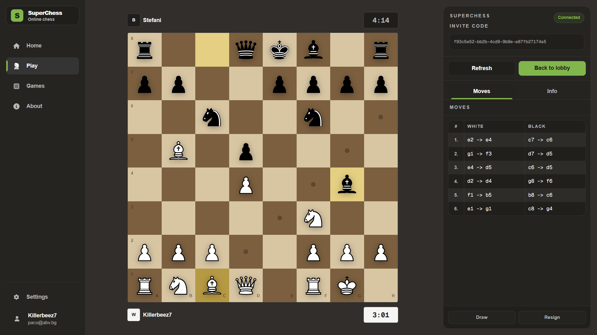
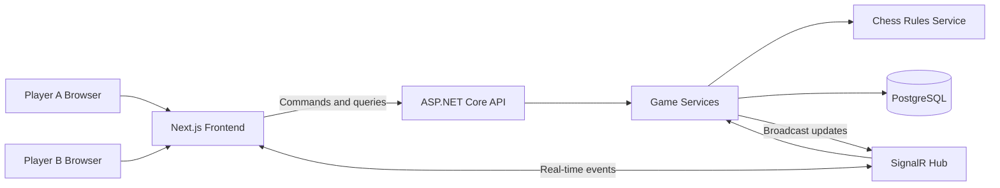
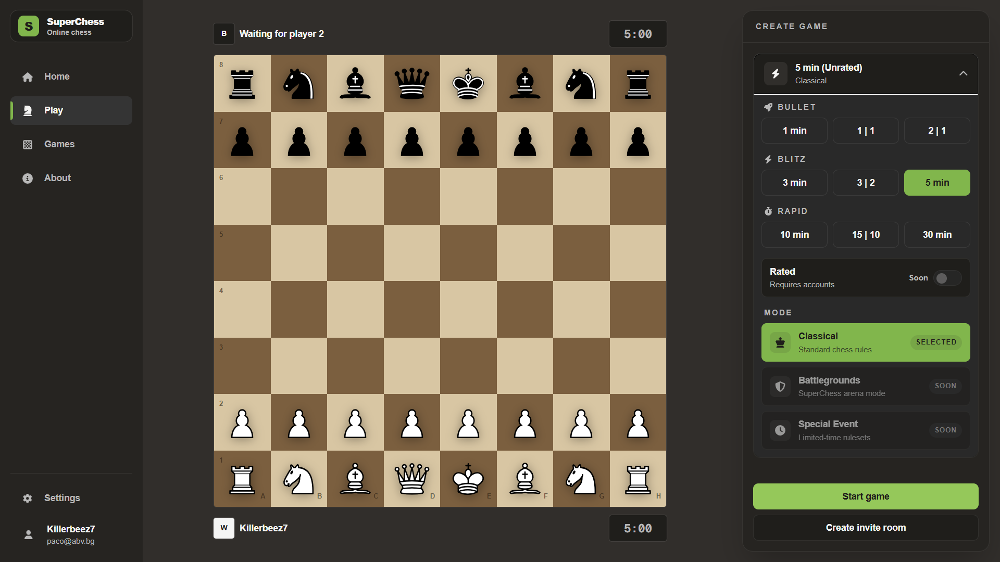
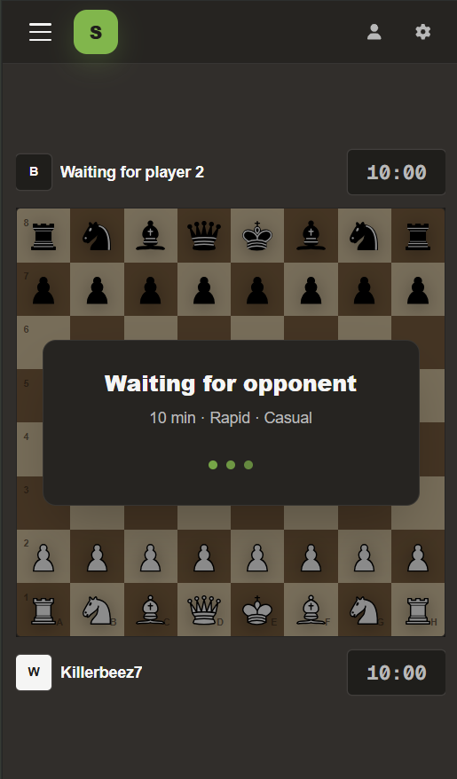

# SuperChess ♟️

A real-time full-stack chess platform built with **Next.js**, **TypeScript**, **ASP.NET Core**, **SignalR**, **Entity Framework Core**, and **PostgreSQL**.

SuperChess provides online 1v1 games with server-authoritative move processing, persistent game state, configurable time controls, and a responsive chessboard experience across desktop and mobile devices.

<p align="center">
  <a href="https://superchess-chi.vercel.app"><strong>Live Demo</strong></a>
  ·
  <a href="#architecture"><strong>Architecture</strong></a>
  ·
  <a href="#local-development"><strong>Local Setup</strong></a>
  ·
  <a href="#api-and-real-time-events"><strong>API & Events</strong></a>
</p>

<p align="center">
  <a href="https://superchess-chi.vercel.app">
    
  </a>
  
  
  
  
</p>





---

## Overview

SuperChess was developed as an end-to-end real-time application covering product planning, domain modeling, API design, database persistence, multiplayer synchronization, deployment, and responsive UI development.

The backend is the source of truth for the game. Clients submit intended actions, while the server verifies player ownership, validates moves, persists the updated position, and broadcasts the result to both players through SignalR.

The architecture separates chess rules from HTTP, real-time communication, persistence, and presentation concerns. This keeps the classical game flow maintainable and leaves room for future custom SuperChess variants.

---

## Key Features

- Online game creation and joining
- Open-game lobby and quick-play flow
- Real-time game-room synchronization through SignalR
- Server-authoritative move validation and game-state updates
- Persistent games, positions, and move history
- Custom chess rules service with unit-tested engine behavior
- Configurable initial clock and increment
- Turn, winner, result, and end-reason tracking
- Responsive drag-and-drop chessboard
- Automatic board orientation for white and black
- Player-session ownership without mandatory account registration
- Sound feedback and mobile support

<!--
REAL-TIME DEMO

1. Create: docs/images/realtime-gameplay.gif
2. Record two browser windows side by side.
3. Show one player creating a game, another joining, and a move appearing in both clients.
4. Keep the GIF around 10–15 seconds and ideally below 8 MB.
5. Uncomment the line below.


-->

---

## Tech Stack

| Area | Technologies |
|---|---|
| Frontend | Next.js, React, TypeScript, Tailwind CSS |
| Backend | ASP.NET Core Web API, C# |
| Real-time communication | SignalR |
| Data access | Entity Framework Core |
| Database | PostgreSQL |
| Testing | .NET unit tests |
| Infrastructure | Docker, Railway, Vercel |
| Workflow | Git, environment-based configuration, EF Core migrations |

---

## Architecture

```text
superchess/
├── backend/
│   └── SuperChess.Api/        # REST API, SignalR hub, EF Core, services
├── core/
│   └── SuperChess.Core/       # Domain models and chess-rule abstractions
├── frontend/
│   └── superchess-web/        # Next.js UI, API client, SignalR client
├── Dockerfile                 # Backend container configuration
└── superchess.sln             # .NET solution
```

### Responsibilities

#### `SuperChess.Api`

- Exposes game-related REST endpoints
- Hosts the SignalR hub
- Coordinates game application services
- Persists games and moves through EF Core
- Enforces player-session and ownership checks
- Broadcasts lobby and game-room updates

#### `SuperChess.Core`

- Contains domain models and chess abstractions
- Defines the rules-service contract
- Keeps chess behavior independent from HTTP and persistence
- Supports future rule implementations without rewriting the API or UI

#### `superchess-web`

- Renders the lobby, game setup, and active game interface
- Handles board interaction and responsive presentation
- Communicates with the REST API
- Maintains SignalR room connections
- Keeps only client-specific interaction state locally

### System Flow



---

## Server-Authoritative Game Flow

1. A player creates or joins a game through the REST API.
2. The frontend joins the corresponding SignalR lobby or game room.
3. A player submits an intended move to the backend.
4. The backend verifies the player, current turn, game status, and move legality.
5. The updated position and move record are persisted.
6. The server broadcasts the validated result to connected clients.
7. Both clients render the state returned by the server.

This prevents either browser from becoming the source of truth and keeps both players synchronized around one persisted game state.

---

## API and Real-Time Events

### REST API

Base path:

```text
/api/games
```

| Method | Endpoint | Purpose |
|---|---|---|
| `GET` | `/api/games` | List available games |
| `POST` | `/api/games` | Create a game |
| `GET` | `/api/games/{id}` | Retrieve the current game state |
| `POST` | `/api/games/{id}/join` | Join an available game |
| `POST` | `/api/games/{id}/move` | Submit a move |

### SignalR Methods

| Method | Purpose |
|---|---|
| `JoinLobby` | Subscribe to open-game updates |
| `LeaveLobby` | Leave the lobby group |
| `JoinGameRoom` | Subscribe to one game's updates |
| `LeaveGameRoom` | Leave the active game room |

### SignalR Events

| Event | Purpose |
|---|---|
| `OpenGamesChanged` | Notify clients that the available-game list changed |
| `PlayerJoined` | Notify the game room that another player joined |
| `MovePlayed` | Broadcast the latest validated move and game state |

REST handles explicit commands and queries. SignalR handles server-pushed changes that must reach connected clients immediately.

---

## Engineering Decisions

### Server-authoritative state

The frontend never decides the final result of a move. The backend validates actions, persists the new state, and returns the authoritative result.

### Replaceable rules service

Chess behavior is accessed through a dedicated rules-service abstraction instead of being coupled directly to controllers, SignalR hubs, or UI components.

```csharp
public interface IChessRulesService
{
    // Representative contract — see the implementation for exact signatures.
    // GetLegalMoves(...)
    // ApplyMove(...)
    // GetGameState(...)
}
```

### Vertical-slice delivery

The application was developed through complete user-facing flows:

1. Create and retrieve a game
2. Join a game
3. Synchronize the lobby and game room
4. Submit, validate, persist, and broadcast moves
5. Add player sessions and ownership
6. Add time controls and terminal game states
7. Improve responsive interaction and feedback

### REST plus SignalR

REST is used for persisted resource operations. SignalR is used for live room notifications. Keeping these responsibilities separate makes the data flow easier to understand and maintain.

---

## Screenshots

### Lobby and game setup



### Active game — desktop

<!--
Create: docs/images/game-desktop.png

Capture:
- Full board
- Both players and clocks
- Current turn or game status
- Move history or game controls

Then replace this comment with:

-->

_Image placeholder: active desktop game_

### Active game — mobile



_Image placeholder: responsive mobile game_

---

## Local Development

### Prerequisites

- .NET 8 SDK
- Node.js 20+
- PostgreSQL
- Git

### 1. Clone the repository

```bash
git clone https://github.com/Killerbeez7/superchess.git
cd superchess
```

### 2. Configure and run the backend

Restore dependencies:

```bash
dotnet restore
```

Configure the local PostgreSQL connection string with .NET user secrets:

```bash
dotnet user-secrets init --project backend/SuperChess.Api

dotnet user-secrets set   "ConnectionStrings:DefaultConnection"   "Host=localhost;Port=5432;Database=superchess;Username=postgres;Password=your-password"   --project backend/SuperChess.Api
```

Apply migrations:

```bash
dotnet ef database update   --project backend/SuperChess.Api   --startup-project backend/SuperChess.Api
```

Start the API:

```bash
dotnet run --project backend/SuperChess.Api
```

Use the API URL printed in the terminal when configuring the frontend.

### 3. Configure and run the frontend

```bash
cd frontend/superchess-web
npm install
```

Create `frontend/superchess-web/.env.local`:

```env
NEXT_PUBLIC_API_URL=http://localhost:<api-port>
```

Start the development server:

```bash
npm run dev
```

Open:

```text
http://localhost:3000
```

> Replace `<api-port>` with the port printed when the ASP.NET Core API starts. Verify the environment-variable name against the frontend configuration before publishing this README.

---

## Testing and Quality Checks

Run the .NET tests:

```bash
dotnet test
```

Run frontend linting:

```bash
cd frontend/superchess-web
npm run lint
```

Create a production frontend build:

```bash
npm run build
```

Current automated coverage focuses on deterministic chess-engine behavior. API integration and end-to-end tests are planned improvements.

---

## Deployment

| Component | Platform |
|---|---|
| Frontend | Vercel |
| Backend | Railway |
| Database | PostgreSQL |
| Backend packaging | Docker |

Frontend and backend deployments are separated so each layer can be configured and released independently. Production values are supplied through platform-managed environment variables and secrets.

---

## Challenges and Lessons Learned

### Real-time synchronization

The main challenge was keeping two independently connected clients synchronized while preserving the backend as the only source of truth.

### SignalR connection lifecycle

Development remounts, route changes, and reconnects require deliberate handling of connection startup, cleanup, and room membership.

### Board orientation and interaction

The same persisted position must render correctly for players on opposite sides while preserving accurate drag-and-drop behavior and responsive controls.

### Server-based clocks

Chess clocks cannot depend only on browser timers. Persisting the active turn's server timestamp allows clients to calculate the visible countdown while the backend retains authoritative timing information.

---

## Current Scope and Roadmap

### Implemented

- [x] API, Core, and Web project structure
- [x] Create, retrieve, and join game flows
- [x] Open-game lobby updates
- [x] SignalR game-room synchronization
- [x] Server-authoritative move submission
- [x] Player sessions and game ownership
- [x] Persistent positions and move history
- [x] Configurable time controls
- [x] Responsive desktop and mobile interface
- [x] Chess-engine unit tests
- [x] Production deployment

### Planned

- [ ] Persistent accounts and player profiles
- [ ] Rating-based matchmaking
- [ ] Reconnection and abandoned-game recovery
- [ ] Draw offers and resignation flows
- [ ] Game history and replay
- [ ] Extended API integration and end-to-end tests
- [ ] Structured observability and health dashboards
- [ ] Computer opponent
- [ ] Custom SuperChess rule variants

---

## Author

**Plamen Tsvetkov**

- GitHub: [@Killerbeez7](https://github.com/Killerbeez7)
- Live demo: [superchess-chi.vercel.app](https://superchess-chi.vercel.app)
